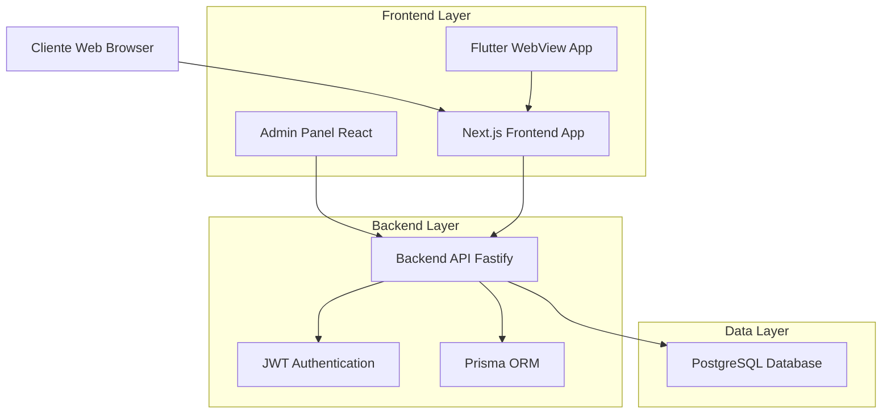
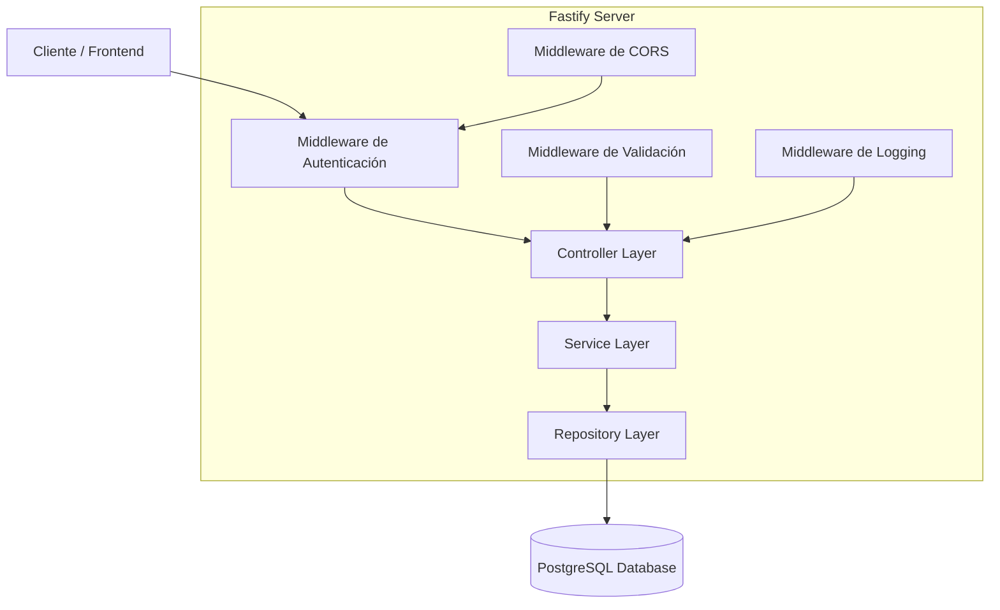
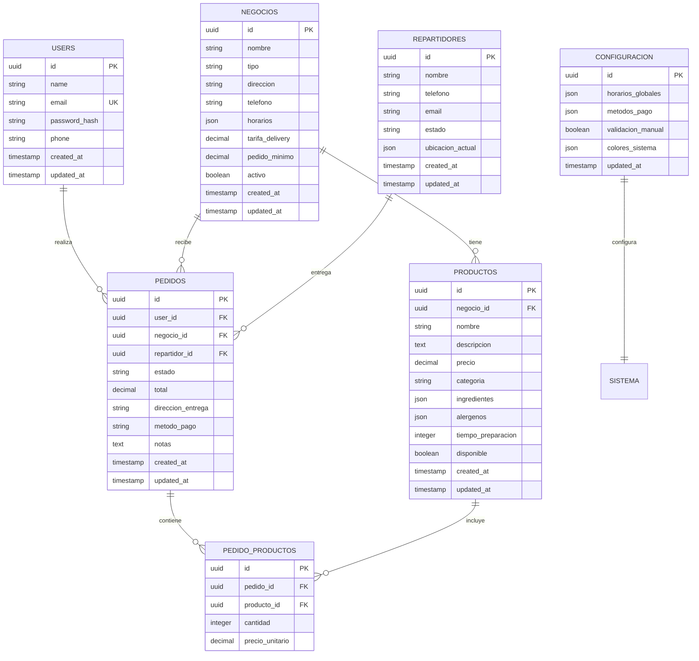

# Documento de Arquitectura Técnica - Jaguar Express

## 1. Diseño de Arquitectura



## 2. Descripción de Tecnologías

### Backend API REST

* **Framework**: Fastify\@4 + TypeScript

* **Base de datos**: PostgreSQL\@15

* **ORM**: Prisma\@5

* **Autenticación**: JWT + bcrypt

* **Validación**: Zod

* **Documentación**: Swagger/OpenAPI

### App Cliente Web

* **Framework**: Next.js\@14 (App Router) + TypeScript

* **Estilos**: TailwindCSS\@3

* **Estado Global**: Zustand

* **HTTP Client**: Axios

* **UI Components**: Headless UI + Heroicons

### App Móvil WebView

* **Framework**: Flutter\@3.16

* **WebView**: webview\_flutter\@4.4

* **Plataformas**: Android + iOS

### Panel Administrativo

* **Framework**: Next.js\@14 + TypeScript

* **UI Library**: Shadcn/ui + Radix UI

* **Estado**: Zustand

* **Data Fetching**: TanStack React Query\@5

* **Estilos**: TailwindCSS\@3

## 3. Definiciones de Rutas

### App Cliente Web

| Ruta            | Propósito                                 |
| --------------- | ----------------------------------------- |
| /               | Página de inicio con servicios destacados |
| /auth/login     | Página de inicio de sesión                |
| /auth/register  | Página de registro de usuario             |
| /negocios       | Explorar negocios por categoría           |
| /negocios/\[id] | Detalle de negocio y productos            |
| /carrito        | Carrito de compras y checkout             |
| /pedidos        | Historial de pedidos del usuario          |
| /pedidos/\[id]  | Seguimiento detallado del pedido          |
| /perfil         | Perfil y configuración del usuario        |

### Panel Administrativo

| Ruta                 | Propósito                        |
| -------------------- | -------------------------------- |
| /admin               | Dashboard principal con métricas |
| /admin/auth          | Login de administrador           |
| /admin/negocios      | Gestión CRUD de negocios         |
| /admin/productos     | Gestión CRUD de productos        |
| /admin/pedidos       | Gestión y seguimiento de pedidos |
| /admin/repartidores  | Gestión de repartidores          |
| /admin/configuracion | Configuración global del sistema |

## 4. Definiciones de API

### 4.1 API Principal del Backend

#### Autenticación de Clientes

```
POST /api/auth/register
```

Request:

| Nombre Parámetro | Tipo   | Requerido | Descripción                      |
| ---------------- | ------ | --------- | -------------------------------- |
| name             | string | true      | Nombre completo del cliente      |
| email            | string | true      | Email único del cliente          |
| password         | string | true      | Contraseña (mínimo 8 caracteres) |
| phone            | string | false     | Número de teléfono               |

Response:

| Nombre Parámetro | Tipo    | Descripción                  |
| ---------------- | ------- | ---------------------------- |
| success          | boolean | Estado de la operación       |
| token            | string  | JWT token para autenticación |
| user             | object  | Datos del usuario registrado |

Ejemplo:

```json
{
  "name": "Juan Pérez",
  "email": "juan@email.com",
  "password": "password123",
  "phone": "+51987654321"
}
```

```
POST /api/auth/login
```

Request:

| Nombre Parámetro | Tipo   | Requerido | Descripción            |
| ---------------- | ------ | --------- | ---------------------- |
| email            | string | true      | Email del cliente      |
| password         | string | true      | Contraseña del cliente |

Response:

| Nombre Parámetro | Tipo    | Descripción                  |
| ---------------- | ------- | ---------------------------- |
| success          | boolean | Estado de la operación       |
| token            | string  | JWT token para autenticación |
| user             | object  | Datos del usuario            |

#### Gestión de Negocios

```
GET /api/negocios
```

Query Parameters:

| Nombre Parámetro | Tipo    | Requerido | Descripción                                      |
| ---------------- | ------- | --------- | ------------------------------------------------ |
| tipo             | string  | false     | Filtrar por tipo (restaurante, tienda, farmacia) |
| zona             | string  | false     | Filtrar por zona geográfica                      |
| abierto          | boolean | false     | Solo negocios abiertos                           |

```
POST /api/negocios
```

Request:

| Nombre Parámetro | Tipo   | Requerido | Descripción                  |
| ---------------- | ------ | --------- | ---------------------------- |
| nombre           | string | true      | Nombre del negocio           |
| tipo             | string | true      | Tipo de negocio              |
| direccion        | string | true      | Dirección física             |
| telefono         | string | true      | Teléfono de contacto         |
| horarios         | object | true      | Horarios de atención por día |
| tarifa\_delivery | number | true      | Costo de delivery            |
| pedido\_minimo   | number | true      | Monto mínimo de pedido       |

#### Gestión de Pedidos

```
POST /api/pedidos
```

Request:

| Nombre Parámetro   | Tipo   | Requerido | Descripción                           |
| ------------------ | ------ | --------- | ------------------------------------- |
| negocio\_id        | string | true      | ID del negocio                        |
| productos          | array  | true      | Lista de productos con cantidades     |
| direccion\_entrega | string | true      | Dirección de entrega                  |
| metodo\_pago       | string | true      | Método de pago (efectivo, yape, plin) |
| notas              | string | false     | Notas adicionales                     |

```
PATCH /api/pedidos/[id]/estado
```

Request:

| Nombre Parámetro | Tipo   | Requerido | Descripción                |
| ---------------- | ------ | --------- | -------------------------- |
| estado           | string | true      | Nuevo estado del pedido    |
| repartidor\_id   | string | false     | ID del repartidor asignado |

#### Gestión de Repartidores

```
GET /api/repartidores/disponibles
```

Response:

| Nombre Parámetro | Tipo   | Descripción                       |
| ---------------- | ------ | --------------------------------- |
| repartidores     | array  | Lista de repartidores disponibles |
| total            | number | Total de repartidores disponibles |

```
PATCH /api/repartidores/[id]/estado
```

Request:

| Nombre Parámetro | Tipo   | Requerido | Descripción                                           |
| ---------------- | ------ | --------- | ----------------------------------------------------- |
| estado           | string | true      | Estado del repartidor (disponible, ocupado, inactivo) |

## 5. Arquitectura del Servidor



## 6. Modelo de Datos

### 6.1 Definición del Modelo de Datos



### 6.2 Lenguaje de Definición de Datos (DDL)

#### Tabla de Usuarios (users)

```sql
-- Crear tabla de usuarios
CREATE TABLE users (
    id UUID PRIMARY KEY DEFAULT gen_random_uuid(),
    name VARCHAR(100) NOT NULL,
    email VARCHAR(255) UNIQUE NOT NULL,
    password_hash VARCHAR(255) NOT NULL,
    phone VARCHAR(20),
    created_at TIMESTAMP WITH TIME ZONE DEFAULT NOW(),
    updated_at TIMESTAMP WITH TIME ZONE DEFAULT NOW()
);

-- Crear índices
CREATE INDEX idx_users_email ON users(email);
CREATE INDEX idx_users_created_at ON users(created_at DESC);
```

#### Tabla de Negocios (negocios)

```sql
-- Crear tabla de negocios
CREATE TABLE negocios (
    id UUID PRIMARY KEY DEFAULT gen_random_uuid(),
    nombre VARCHAR(200) NOT NULL,
    tipo VARCHAR(50) NOT NULL CHECK (tipo IN ('restaurante', 'tienda', 'farmacia', 'otros')),
    direccion TEXT NOT NULL,
    telefono VARCHAR(20) NOT NULL,
    horarios JSONB NOT NULL,
    tarifa_delivery DECIMAL(10,2) NOT NULL DEFAULT 0,
    pedido_minimo DECIMAL(10,2) NOT NULL DEFAULT 0,
    activo BOOLEAN DEFAULT true,
    created_at TIMESTAMP WITH TIME ZONE DEFAULT NOW(),
    updated_at TIMESTAMP WITH TIME ZONE DEFAULT NOW()
);

-- Crear índices
CREATE INDEX idx_negocios_tipo ON negocios(tipo);
CREATE INDEX idx_negocios_activo ON negocios(activo);
```

#### Tabla de Productos (productos)

```sql
-- Crear tabla de productos
CREATE TABLE productos (
    id UUID PRIMARY KEY DEFAULT gen_random_uuid(),
    negocio_id UUID NOT NULL REFERENCES negocios(id) ON DELETE CASCADE,
    nombre VARCHAR(200) NOT NULL,
    descripcion TEXT,
    precio DECIMAL(10,2) NOT NULL,
    categoria VARCHAR(100),
    ingredientes JSONB,
    alergenos JSONB,
    tiempo_preparacion INTEGER DEFAULT 0,
    disponible BOOLEAN DEFAULT true,
    created_at TIMESTAMP WITH TIME ZONE DEFAULT NOW(),
    updated_at TIMESTAMP WITH TIME ZONE DEFAULT NOW()
);

-- Crear índices
CREATE INDEX idx_productos_negocio_id ON productos(negocio_id);
CREATE INDEX idx_productos_categoria ON productos(categoria);
CREATE INDEX idx_productos_disponible ON productos(disponible);
```

#### Tabla de Pedidos (pedidos)

```sql
-- Crear tabla de pedidos
CREATE TABLE pedidos (
    id UUID PRIMARY KEY DEFAULT gen_random_uuid(),
    user_id UUID NOT NULL REFERENCES users(id),
    negocio_id UUID NOT NULL REFERENCES negocios(id),
    repartidor_id UUID REFERENCES repartidores(id),
    estado VARCHAR(50) NOT NULL DEFAULT 'pendiente' CHECK (estado IN ('pendiente', 'confirmado', 'en_preparacion', 'en_camino', 'entregado', 'cancelado')),
    total DECIMAL(10,2) NOT NULL,
    direccion_entrega TEXT NOT NULL,
    metodo_pago VARCHAR(20) NOT NULL CHECK (metodo_pago IN ('efectivo', 'yape', 'plin')),
    notas TEXT,
    created_at TIMESTAMP WITH TIME ZONE DEFAULT NOW(),
    updated_at TIMESTAMP WITH TIME ZONE DEFAULT NOW()
);

-- Crear índices
CREATE INDEX idx_pedidos_user_id ON pedidos(user_id);
CREATE INDEX idx_pedidos_estado ON pedidos(estado);
CREATE INDEX idx_pedidos_created_at ON pedidos(created_at DESC);
CREATE INDEX idx_pedidos_repartidor_id ON pedidos(repartidor_id);
```

#### Tabla de Repartidores (repartidores)

```sql
-- Crear tabla de repartidores
CREATE TABLE repartidores (
    id UUID PRIMARY KEY DEFAULT gen_random_uuid(),
    nombre VARCHAR(100) NOT NULL,
    telefono VARCHAR(20) NOT NULL,
    email VARCHAR(255) UNIQUE,
    estado VARCHAR(20) NOT NULL DEFAULT 'inactivo' CHECK (estado IN ('disponible', 'ocupado', 'inactivo')),
    ubicacion_actual JSONB,
    created_at TIMESTAMP WITH TIME ZONE DEFAULT NOW(),
    updated_at TIMESTAMP WITH TIME ZONE DEFAULT NOW()
);

-- Crear índices
CREATE INDEX idx_repartidores_estado ON repartidores(estado);
CREATE INDEX idx_repartidores_email ON repartidores(email);
```

#### Datos Iniciales

```sql
-- Insertar configuración inicial
INSERT INTO configuracion (horarios_globales, metodos_pago, validacion_manual, colores_sistema) VALUES (
    '{"lunes": {"inicio": "08:00", "fin": "22:00"}, "martes": {"inicio": "08:00", "fin": "22:00"}}',
    '["efectivo", "yape", "plin"]',
    false,
    '{"primario": "#FFD700", "secundario": "#1A1A1A", "fondo": "#F5F5F5"}'
);

-- Insertar negocio de ejemplo
INSERT INTO negocios (nombre, tipo, direccion, telefono, horarios, tarifa_delivery, pedido_minimo) VALUES (
    'Restaurante El Jaguar',
    'restaurante',
    'Av. Principal 123, Lima',
    '+51987654321',
    '{"lunes": {"inicio": "11:00", "fin": "23:00"}}',
    5.00,
    15.00
);
```

