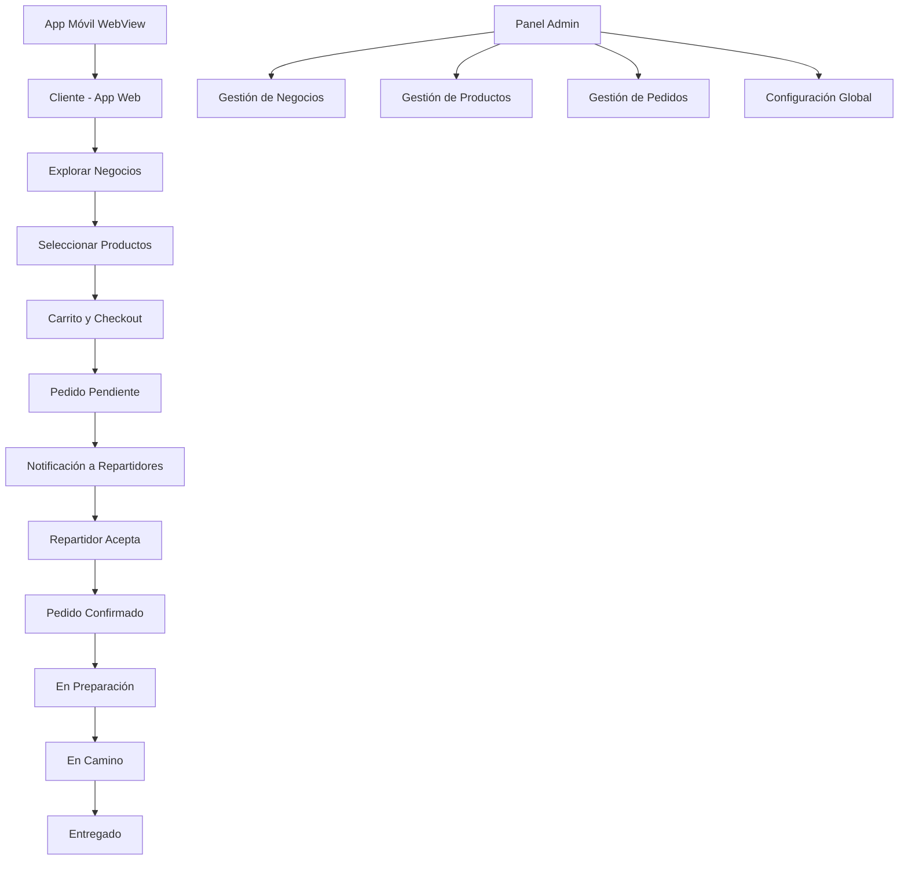

# Documento de Requerimientos del Producto - Jaguar Express

## 1. Visión General del Producto

Jaguar Express es un ecosistema integral de delivery, encargos y transporte que conecta clientes, negocios y repartidores a través de una plataforma tecnológica moderna y escalable. El sistema está diseñado para ofrecer velocidad, confiabilidad y eficiencia en la entrega de productos, con un enfoque en la experiencia del usuario y la gestión centralizada.

El ecosistema resuelve la necesidad de una plataforma unificada que permita a los usuarios acceder a múltiples servicios de delivery (comida, encargos personalizados y transporte de carga) mientras proporciona a los administradores herramientas completas de gestión y control.

## 2. Características Principales

### 2.1 Roles de Usuario

| Rol | Método de Registro | Permisos Principales |
|-----|-------------------|---------------------|
| Cliente | Registro por email con validación | Explorar negocios, realizar pedidos, seguimiento en tiempo real |
| Repartidor | Registro opcional con verificación | Recibir pedidos, actualizar estados, gestionar disponibilidad |
| Administrador | Acceso controlado con credenciales especiales | Gestión completa del sistema, configuración global, reportes |
| Negocio | Registro y aprobación administrativa | Gestionar productos, horarios, promociones |

### 2.2 Módulos de Características

Nuestro ecosistema Jaguar Express está conformado por las siguientes aplicaciones principales:

1. **Backend API REST**: Sistema central de gestión con autenticación JWT, módulos de negocios, productos, pedidos, repartidores y configuración global.
2. **App Cliente Web**: Interfaz para usuarios finales con exploración de negocios, carrito de compras, seguimiento de pedidos y gestión de perfil.
3. **App Móvil WebView**: Experiencia móvil nativa que carga la aplicación web cliente para acceso optimizado desde dispositivos móviles.
4. **Panel Administrativo**: Interfaz de gestión completa para administradores con control total del ecosistema.

### 2.3 Detalles de Páginas

| Nombre de Página | Nombre del Módulo | Descripción de Características |
|------------------|-------------------|-------------------------------|
| **App Cliente Web** | Página de Inicio | Mostrar negocios destacados, categorías de servicios (comida, encargos, transporte), búsqueda por zona, banner promocional |
| App Cliente Web | Explorar Negocios | Filtrar por tipo (restaurante, tienda, farmacia), mostrar horarios, tarifas de delivery, tiempo estimado, calificaciones |
| App Cliente Web | Detalle de Negocio | Mostrar productos/servicios, categorías, ingredientes, alérgenos, tiempo de preparación, agregar al carrito |
| App Cliente Web | Carrito y Checkout | Revisar productos, calcular totales, seleccionar método de pago (efectivo, yape, plin), confirmar dirección de entrega |
| App Cliente Web | Seguimiento de Pedido | Estado en tiempo real (pendiente, confirmado, preparación, en camino, entregado), información del repartidor, mapa de ubicación |
| App Cliente Web | Perfil de Usuario | Datos personales, historial de pedidos, direcciones guardadas, métodos de pago preferidos |
| **Panel Administrativo** | Dashboard Principal | Resumen de pedidos activos, estadísticas de ventas, repartidores disponibles, alertas del sistema |
| Panel Administrativo | Gestión de Negocios | CRUD de negocios, configurar horarios, zonas de cobertura, tarifas, promociones, imágenes de menú |
| Panel Administrativo | Gestión de Productos | CRUD de productos, categorías, ingredientes, alérgenos, control de inventario (disponible/agotado) |
| Panel Administrativo | Gestión de Pedidos | Vista por estados, filtros por cliente/negocio, asignación manual de repartidores, cambio de estados |
| Panel Administrativo | Gestión de Repartidores | CRUD de repartidores, control de disponibilidad, historial de entregas, métricas de rendimiento |
| Panel Administrativo | Configuración Global | Horarios de operación, métodos de pago, validación de entrega, colores del sistema, tarifas base |
| **Backend API** | Autenticación | Registro/login de clientes y administradores, generación de JWT, validación de tokens, protección de rutas |
| Backend API | Gestión de Datos | CRUD completo para todas las entidades, relaciones entre negocios-productos-pedidos, logs de actividad |

## 3. Proceso Principal

### Flujo del Cliente:
1. El cliente se registra e inicia sesión en la aplicación web
2. Explora negocios disponibles filtrados por zona y tipo
3. Selecciona un negocio y navega por sus productos
4. Agrega productos al carrito respetando horarios y disponibilidad
5. Procede al checkout seleccionando método de pago
6. Confirma el pedido que pasa a estado "pendiente"
7. Recibe notificaciones de cambios de estado en tiempo real
8. Realiza el pago al repartidor al momento de la entrega

### Flujo del Repartidor:
1. El repartidor se registra (opcional) y marca su disponibilidad
2. Recibe notificaciones de pedidos nuevos en su zona
3. El primer repartidor que acepta toma el pedido (cambia a "confirmado")
4. Compra los productos en el negocio correspondiente
5. Actualiza el estado a "en preparación" y luego "en camino"
6. Entrega el pedido y cobra al cliente
7. Confirma la entrega (estado "entregado")

### Flujo del Administrador:
1. Accede al panel administrativo con credenciales especiales
2. Monitorea pedidos activos y métricas del sistema
3. Gestiona negocios, productos y repartidores
4. Configura parámetros globales del sistema
5. Resuelve incidencias y asigna pedidos manualmente si es necesario

## 4. Diseño de Interfaz de Usuario

### 4.1 Estilo de Diseño

- **Colores Primarios**: 
  - Jaguar Dorado: #FFD700 (botones principales, acentos)
  - Jaguar Negro: #1A1A1A (texto principal, navegación)
  - Jaguar Gris: #F5F5F5 (fondos, tarjetas)
- **Estilo de Botones**: Redondeados con sombras suaves, efecto hover con transiciones
- **Tipografía**: 
  - Fuente principal: Inter o similar (16px para texto, 24px para títulos)
  - Fuente secundaria: Roboto para datos numéricos
- **Estilo de Layout**: Diseño basado en tarjetas con navegación superior fija
- **Iconografía**: Iconos outline style con emoji complementarios para servicios (🛵🛒🚚)

### 4.2 Resumen de Diseño de Páginas

| Nombre de Página | Nombre del Módulo | Elementos de UI |
|------------------|-------------------|----------------|
| App Cliente Web | Página de Inicio | Header fijo con logo y navegación, hero section con búsqueda, grid de categorías con iconos, tarjetas de negocios destacados |
| App Cliente Web | Explorar Negocios | Filtros laterales colapsables, grid responsivo de tarjetas de negocios, badges de estado (abierto/cerrado), ratings con estrellas |
| App Cliente Web | Detalle de Negocio | Header con imagen del negocio, tabs para categorías de productos, cards de productos con imágenes, botón flotante de carrito |
| App Cliente Web | Carrito y Checkout | Lista de productos con controles de cantidad, resumen de costos, formulario de dirección, selector de método de pago |
| App Cliente Web | Seguimiento | Stepper visual del estado del pedido, mapa interactivo, card del repartidor con foto y contacto, timer estimado |
| Panel Administrativo | Dashboard | Cards de métricas con iconos, gráficos de barras y líneas, tabla de pedidos recientes, indicadores de estado en tiempo real |
| Panel Administrativo | Gestión de Negocios | Tabla con filtros y búsqueda, modal de edición, upload de imágenes drag & drop, toggle switches para estados |
| Panel Administrativo | Configuración | Formularios organizados en tabs, color picker para personalización, sliders para configuraciones numéricas |

### 4.3 Responsividad

El sistema está diseñado con enfoque mobile-first y adaptación completa a desktop:
- **Breakpoints**: 320px (móvil), 768px (tablet), 1024px (desktop)
- **Navegación**: Hamburger menu en móvil, navegación horizontal en desktop
- **Interacciones táctiles**: Botones con área mínima de 44px, gestos de swipe para navegación
- **Optimización móvil**: Carga lazy de imágenes, compresión automática, caché local para mejor rendimiento